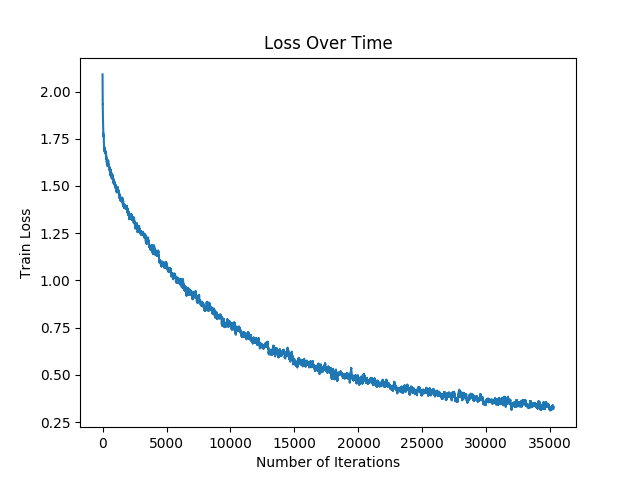

# Fashion Attribute classification

using this [data](https://purl.stanford.edu/tb980qz1002) from Stanford. Used 80/20 train test split

# Training Loss 

 

# Confusion Matrix for the test data

Test Accuracy : 0.9898921832884097

