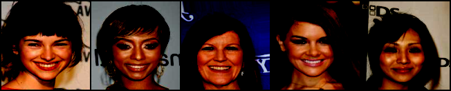

## StarGAN CelebA Dataset

Motivated by this [paper](https://arxiv.org/pdf/1511.02251.pdf) . Using CelebA dataset and using RESNet50 to predict attributes and later using that attribute to query similar images. 

## Training Progress

Ran 30 epochs total where 15 with 0.001 LR and linearly decreasing for the last 15 epochs.

## Test

After training, Fed 256 images to get the attributes and using SKLEARN's KNN to get 5 closest neighbor. 

