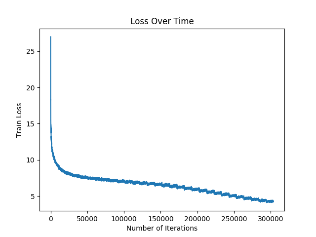

## StarGAN CelebA Dataset

Training was done on the entire CelebA dataset. The Architecture of the model is the same as in the original paper. It was trained with a constant LR of 0.0001 for the first 15 epochs, and was decreased every epoch for the next 15 epochs. The chosen attributes were Black_Hair, Blonde_Hair, Brown_Hair, Gray_Hair. It's quite apparently from the training images that Gray_Hair is associated with looking old as one can see the images are also transformed to makes the person look old. 

## Training Progress

## Test

Tested on a face dataset found online. Images that are similar to the training images in terms of crop performs well where as images that are significantly different don't perform as well as expected. 

